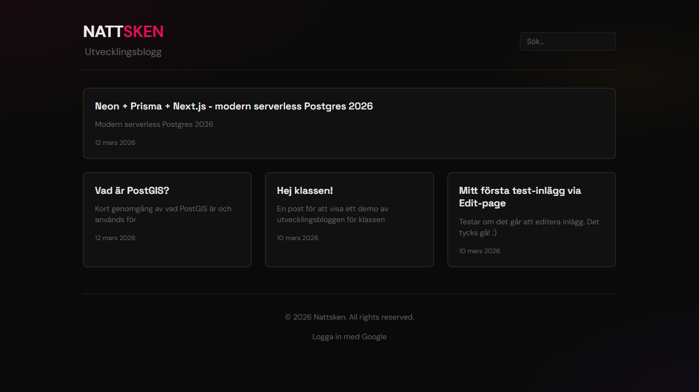

#  Utvecklingsblogg - Nattsken

**Ett individuellt arbete för Lexicon Front-end-utbildningen 2025-2026**

Projekt för https://github.com/Lexicon-Utbildning-Front-end-2025-2026/individuellt-arbete

Live version: https://blogg.nattsken.se

## 📋 Projektbeskrivning

### Intro
Jag vill simulera en verklighetstrogen uppgift där jag kastas in i ett projekt och ska utveckla en blogg åt något företag. I detta fall är det faktiskt ett projekt jag startat vid sidan av Lexicon med projektnamnet **Nattsken**. Mycket av koden, designen, frontend i Next.js, backend i Express m.m. finns redan klart för det projektet. Men - stora delar av det projektet är saker jag inte vill dela publikt och passar därför inte scope:et för detta individuella projekt åt Lexicon.

### Projektet
Projektet är en utvecklingsblogg för just den plattformen, där jag kan dokumentera det arbete som görs och hur arbetet fortskrider vid sidan om faktiska plattformen.
Skriven i Next.js och vara rätt simpel rent layout-mässigt, men extra vikt läggs vid att anpassa bloggen så den matchar existerande design utifrån referenser.

Tanken med detta upplägg är för att uppfylla både uppgiften men samtidigt få något jag kan använda i utvecklingen för mitt existerande projekt också.

### Design
Designen/Layout tas fram med Figma, men ska utgå ifrån inspirationslänkarna nedan.

Utvecklingsbloggen ska anpassas så att färger, typografi och känsla passar **Nattsken** i övrigt - enligt existerande designdokument.

#### Inspiration
- [Cloudflare: Blogg](https://blog.cloudflare.com) 
- [Cloudflare: Individuell bloggpost](https://blog.cloudflare.com/vinext/)

## 🛠️ Tech-stack

- **Framework**: Next.js 16 (App Router) + TypeScript
- **Rich text-editor**: Tiptap
- **Styling**: Tailwind CSS (**anpassat** efter Nattskens designsystem)
- **Databas**: Neon (Serverless PostgreSQL), Prisma ORM
- **Autentisering**: Better Auth + Google OAuth (endast @jine.se)
- **Validering**: Zod
- **Bildhantering**: Lokal uppladdning i admin
- **Deployment**: Self-hosted Coolify (Docker)
- **Testing**: Playwright (E2E)

## 📦 Projektdelar

### Publik del
- Publicerade inlägg i grid
- Individuella, snyggt formaterade bloggposter (HTML)
- Postat när och med taggar
- Responsiv design som matchar Nattskens vibe, med extra fokus på Mobile First
- Enkel sökning efter inlägg

### Administration (skyddad med inloggning)
- Full CRUD för bloggposter
- Rich text med [Tiptap](https://tiptap.dev/) + möjlighet att klistra in bilder
- Strikt validering med [Zod](https://zod.dev/) på all indata
- Google OAuth med domänbegränsning (jine.se)
- Visuell markering av opublicerade inlägg (utkast)

### Övrigt
- Neon databas ([Neon](https://neon.com/))
- [Prisma ORM](https://www.prisma.io/)
- [Dockerfile](https://github.com/vercel/next.js/blob/canary/examples/with-docker/Dockerfile) för deployment

## 🚀 Installation

### Förkrav
- [Node.js](https://nodejs.org/) (version 20+)
- [PostgreSQL](https://www.postgresql.org/) databas (eller [Neon](https://neon.tech) för serverless)
- Google OAuth credentials (https://console.cloud.google.com/)

### Steg-för-steg

1. **Klona repot**
   ```bash
   git clone <repo-url>
   cd utvecklingsblogg
   ```

2. **Installera dependencies**
   ```bash
   npm install
   ```

3. **Konfigurera miljövariabler**
   ```bash
   cp .env.example .env
   ```
   
   Redigera `.env` och fyll i:
   - `DATABASE_URL` - Din PostgreSQL connection string
   - `GOOGLE_CLIENT_ID` & `GOOGLE_CLIENT_SECRET` - Från Google Cloud Console
   - `BETTER_AUTH_SECRET` - Generera en stark slumpmässig sträng, används för Better Auth
   - `NEXT_PUBLIC_APP_URL` - Din lokala URL (t.ex. `http://localhost:3000`)

4. **Kör databasmigreringar**
   ```bash
   npx prisma migrate dev
   ```

5. **Starta utvecklingsservern**
   ```bash
   npm run dev
   ```

   Besök [http://localhost:3000](http://localhost:3000)

## 🧪 Bonus / Expriment

### Github Workflow
Som en bonus finns det ett supersimpelt [Github Workflow](https://docs.github.com/en/actions/how-tos/write-workflows) i detta projekt, som säkerställer att PR mot main är korrekt, att E2E går igenom, att lint lyckas och att applikationen bygger fullt ut (npm run build).

Mer detaljer finns i [.github/workflows/ci.yml](https://github.com/jine/utvecklingsblogg/blob/main/.github/workflows/ci.yml)

### Automagisk Lint vid commit
En till bonusfeature som finns med i projektet är [husky](https://typicode.github.io/husky/), ett plugin som automagiskt kör lint vid commits, för att säkerställa att kodbasen har rätt kodstandard och formatering.

[.husky/pre-commit](https://github.com/jine/utvecklingsblogg/blob/main/.husky/pre-commit)

### E2E Testing

Lite som en sista bonus så har jag lagt till ett superenkelt E2E test i detta projekt, det enda den egentligen gör / kollar efter är om startsidan laddar och det finns fler än en <article> synlig, men jag la till det mest lite som expriment och bonus.

Du hittar E2E Test specifikationerna [här](https://github.com/jine/utvecklingsblogg/tree/main/e2e).

E2E ligger numera även med i CI-jobbet (github workflow:et) ovan.

Det går även att köra testerna manuellt enligt nedan

#### Köra E2E-tester med Playwright

```bash
# Kör tester i UI-läge
npx playwright test --ui

# Kör alla tester
npx playwright test

# Kör tester i specifik browser
npx playwright test --project=chromium
```

## 📸 Screenshot



## 📅 Projektplanering (Lexicon)

- **GitHub Projects + Project Backlog**: [Projekt Utvecklingsblogg](https://github.com/users/jine/projects/5)
- **Wireframes / Designskiss**: [Utkast 1](https://www.figma.com/make/ni24Umd4pqnUxOT8V821xO/Develop-Blog-for-Nattsken?t=uumlYSsbnfbGeXpY-1)

### Nattsken-referensdokument (Ej publika)
- **Design System Reference**: https://github.com/jine/nattsken.se/blob/main/DESIGN.md
- **README.md**: https://github.com/jine/nattsken.se/blob/main/README.md
- **API.md**: https://github.com/jine/nattsken.se/blob/main/API.md
- **ARCHITECTURE.md**: https://github.com/jine/nattsken.se/blob/main/ARCHITECTURE.md

## 👤 Om mig / Övrigt

Projektet är utvecklat av mig - **Jim Nelin** som ett "mini projekt" på ca 2 veckor inkl. planering/demo för min portfolio. Läs mer om kraven på https://github.com/Lexicon-Utbildning-Front-end-2025-2026/individuellt-arbete.

- E-post: [jim@jine.se](mailto:jim@jine.se)
- GitHub: [@jine](https://github.com/jine)
- Websajt/Porfolio: [jimnelin.com](https://jimnelin.com)
- LinkedIn: [Jim Nelin](https://www.linkedin.com/in/jimnelin/)

